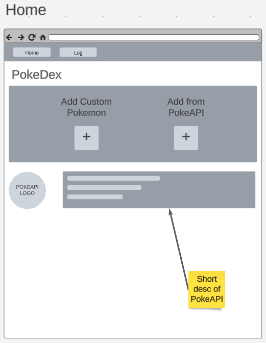
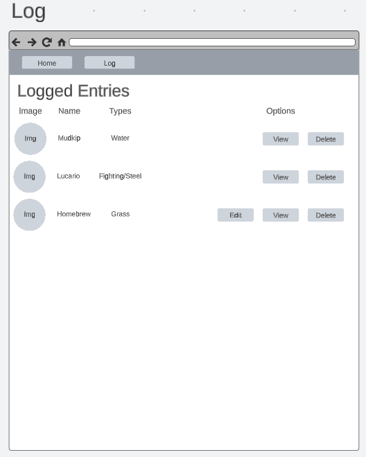
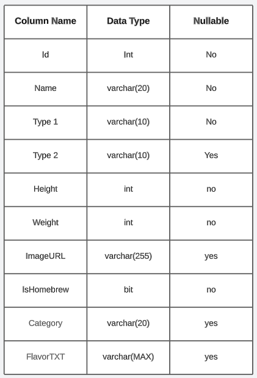

# Code Louisville Project Plan

## Project Brief
A PokeDex web application that will allow users to create and store homebrew Pokemon entries. Users will also be able to search PokeAPI and add pokemon to the DB from there.

## Technical Description
I will be using Entity Framework to perform CRUD operations against a db table that will be storing PokeDex entries. I will also utilize REST to make requests to PokeAPI. PokeAPI data will be parsed and displayed to the user.

## Visuals:
### Home Page Layout

### Add Pages Layout

### Log Page Layout

### Table Structure

## Requirements:
- Create a dictionary or list, populate it with several values, retrieve at least one value, and use it in your program.
- Make your application asynchronous.
- Query your database using a raw SQL query, not EF.

## Stretch Goals:
Make a generic class and use it
Implement a log that records errors, invalid inputs, or other important events and writes them to a text file

## Code:
- Entity Frame work (Likely SQLite)
	- db context
	- validation
	- read, insert, update, delete methods
- Razor work
	- page routing
- PokeAPI work
	- Accept user input
	- validate input
	- make request to PokeAPI
	- parse, format, display response
	